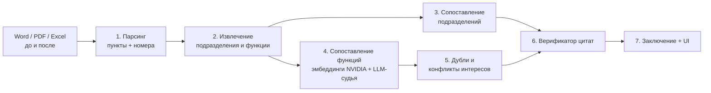

# OrgScan — ИИ-агент анализа организационной структуры

Прототип для кейса HackAlem AI. Агент сравнивает документы «до» и «после» реорганизации, определяет,
какие подразделения сохранены, преобразованы или созданы, и находит потери функций, дублирования
и конфликты интересов. **Каждый вывод подтверждён дословной цитатой с указанием документа и пункта.**

> Выводы носят рекомендательный характер и требуют проверки ответственным сотрудником.

## Быстрый старт

```bash
python -m venv .venv && source .venv/bin/activate      # Windows: .venv\Scripts\activate
pip install -r requirements.txt
cp .env.example .env                                    # заполнить ключи
streamlit run app.py
```

В боковой панели выберите «Тестовый комплект» и нажмите «Анализировать».

CLI без интерфейса:

```bash
python -m pipeline.run data/test_set/before data/test_set/after -o output/report.json
python eval.py output/report.json data/test_set/ground_truth.json
pytest -q
```

## Архитектура



| Шаг | Модуль | Что делает |
|---|---|---|
| 1 | `pipeline/parse.py` | Word / PDF / Excel → фрагменты с номером пункта, страницей и разделом |
| 2 | `pipeline/extract.py` | Подразделения и их функции, тип действия каждой функции |
| 3 | `pipeline/match_units.py` | Статусы: сохранено / переименовано / объединено / разделено / упразднено / создано |
| 4 | `pipeline/match_functions.py` | Для каждой функции «до»: покрыта / частично / потеряна |
| 5 | `pipeline/duplicates.py`, `conflicts.py` | Дубли между подразделениями, несовместимые функции внутри одного |
| 6 | `pipeline/verifier.py` | Каждая цитата ищется в исходном тексте; не найдена — вывод отклоняется |
| 7 | `pipeline/report.py`, `app.py` | Заключение, таблицы, экспорт |

**Защита от галлюцинаций.** LLM не пишет выводы «из головы»: каждый вывод содержит дословную цитату, и верификатор
проверяет её наличие в исходном документе (rapidfuzz). Неподтверждённые выводы не попадают в заключение
и показываются отдельно во вкладке «Отклонено верификатором».

**Модели.** Дешёвая модель OpenAI извлекает функции, сильная судит спорные пары и пишет заключение.
Эмбеддинги NVIDIA NIM ищут кандидатов для сопоставления. Все ответы кэшируются в `.cache/`.

Форматы данных — в [`contracts.md`](contracts.md).

## Тестовые данные

`data/test_set/` — синтетический комплект вымышленной компании с заранее заложенными изменениями:
объединение, упразднение, переименование, создание подразделения, 2 потери функций, 2 дублирования,
1 конфликт интересов и ловушка на ложное срабатывание. Эталон — `ground_truth.json`, описание — `README_dataset.md`.

## Ограничения
- Агент не формирует утверждений, не подтверждённых документами.
- Сканы PDF без текстового слоя не поддерживаются.
