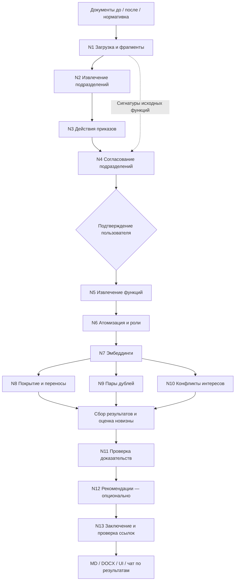

# OrgDiff Agent

Агент сравнивает организационную структуру и функции подразделений до и после
реорганизации. Планируемый результат — изменения подразделений, перемещения и
потери функций, дублирования и конфликты интересов с точными цитатами источников.
Основа проекта — детерминированный пайплайн с проверяемыми вызовами LLM,
подтверждением пользователем и экспортом заключения.

**Реализованы T0–T10:** загрузка документов, подразделения и приказы, анализ
функций, проверка доказательств, заключение и экспорт Markdown/DOCX.
Каждый этап доступен как Python-функция и сохраняет JSON-артефакт.
Пошаговый план со статусами **[Done]** — в [PLAN.md](PLAN.md).
Следующий этап — T11: объединить модули в LangGraph с подтверждением изменений
и полным CLI. Команды `run`, `report`, `eval` пока остаются заглушками и
завершаются с ненулевым кодом; текущий сквозной сценарий запускается через
интеграционные тесты. UI относится к T13, полный запуск сервиса — к T15.

## Основной запуск — Docker

Нужен Docker Desktop/Engine с Linux-контейнерами и Docker Compose v2.
Из корня проекта в PowerShell:

```powershell
if (-not (Test-Path -LiteralPath .env)) { Copy-Item .env.example .env }
docker compose up --build --abort-on-container-exit --exit-code-from orgagent
docker compose --profile tools build tests
docker compose run --rm tests
```

**Сейчас контейнер проверяет настройки и завершает работу.** Постоянный
веб-сервис появится после реализации пайплайна и UI. Полный сервис будет
запускаться через `docker compose up --build` на T15. Тесты выполняются в
отдельном контейнере без сети и без API-ключа.

Анализ demo до отчёта уже проверяется отдельным интеграционным сценарием в
Docker с ключом из `.env`. Команда и mounts для сохранения отчёта на компьютере
приведены в [docs/docker.md](docs/docker.md).

Подробности команд, mounts и постоянных volumes — в
[docs/docker.md](docs/docker.md). Python на компьютере для Docker-запуска не нужен.

## Локальная среда разработки

Нужен Python 3.11+. Из корня репозитория в PowerShell:

```powershell
python -m venv .venv
.\.venv\Scripts\python.exe -m pip install -e ".[dev,pipeline]"
if (-not (Test-Path .env)) { Copy-Item .env.example .env }
.\.venv\Scripts\orgagent.exe --help
.\.venv\Scripts\orgagent.exe check
.\.venv\Scripts\python.exe -m pytest -q
.\.venv\Scripts\ruff.exe check .
```

Если окружение уже создано, повторно создавать его не требуется. `.env` создавайте
только при его отсутствии, чтобы сохранить свои настройки. Автономные тесты
и проверка конфигурации работают без ключа API.

Для установленного `uv` предусмотрена зафиксированная среда:

```powershell
uv sync --extra dev --extra pipeline --locked
uv run orgagent --help
uv run orgagent check
uv run pytest -q
uv run ruff check .
```

В Linux/macOS путь к командам — `.venv/bin/`; пример окружения можно скопировать
командой `cp .env.example .env`. Группа `ui` подключается при реализации T13.
Для интеграционного анализа с реальным провайдером укажите ключ и доступные
модели в `.env`, затем выполните:

```powershell
uv run pytest tests/test_pipeline_live.py --run-llm -q
```

Сценарий проверяет T4–T10 и создаёт `runs/demo-development/report.json`,
`report.md` и `report.docx`, используя реальный API и кэш ответов.
Подробности экспорта и самостоятельного перезапуска T10 — в
[docs/report.md](docs/report.md).

## Архитектура



Модули N1–N11 и N13 реализованы и проверены совместно. Граф, барьеры ветвей
и подтверждение пользователя реализуются на T11; N12 остаётся опциональным.
Рекомендации уже входят в итоговое заключение. Ответственность модулей,
артефакты, зависимости и правила возобновления описаны в
[docs/architecture.md](docs/architecture.md). Разбор пробелов исходного плана
внесён в [дополнение AGENTS.md](AGENTS.md#15-уточнения-плана-по-аудиту-t0).

## Прослеживаемость

Каждый вывод связан с существующими `fragment_id`. Цитата копируется из
`Fragment.text`; модель не сочиняет её. Перед публикацией выводов проверяются
ссылки, поля источников и цитаты. Заключение строится по подтверждённым данным
и ссылается на ID выводов. Неизвестные источники исключают вывод из отчёта,
подменённые цитаты восстанавливаются из исходных фрагментов. Если заключение
LLM не проходит проверку после ограниченных повторов, используется шаблон.
Проверка ссылок не заменяет экспертную оценку смысла: выводы содержат confidence,
а недостаток документов отмечается отдельно. HITL будет подключён на T11.

## Стек и зависимости

Python 3.11+, Pydantic v2 и Typer образуют основу. Группа `pipeline` содержит
OpenAI SDK, LangGraph с SQLite, python-docx, PyMuPDF, openpyxl, pytesseract,
rapidfuzz, numpy, diskcache и Jinja2. Группа `ui` — Streamlit и Plotly; `api`
оставлена опциональной. Тестирование — pytest и ruff в группе `dev`.

Дополнения к таблице стека AGENTS.md: `python-dotenv` читает предусмотренный
`.env`, `PyYAML` безопасно загружает предусмотренные YAML-файлы,
`langgraph-checkpoint-sqlite` поставляет отдельно распространяемый SQLite
чекпоинтер, `uvicorn` нужен только для опционального FastAPI. Ruff прямо указан
в T0. `pdf2image` в группе `dev` нужен для визуальной проверки DOCX.
Tesseract с языками `rus`, `kaz`, `eng` уже установлен в Docker для OCR.
Тестовый образ также содержит LibreOffice, Poppler и шрифты с кириллицей;
runtime создаёт DOCX через `python-docx` и не требует офисного пакета.

## Датасет и сценарий демо

Исходный комплект находится в `HackAlem_test_dataset/`, тестовая копия —
в `data/demo/`. По запросу пользователя читаемые кириллические имена восстановлены
в обоих каталогах; содержимое файлов не изменено. Журнал старых/новых имён и
SHA-256 — [eval/dataset_renames.json](eval/dataset_renames.json).
Отчёт о проверке содержимого:
[eval/dataset_audit.md](eval/dataset_audit.md).

Для повторной подготовки из исходного комплекта:

```powershell
uv run python eval/prepare_demo.py --source HackAlem_test_dataset --destination data/demo --ground-truth ground_truth.json
```

Целевой сценарий после T13: загрузка двух комплектов → согласование подразделений
→ таблица функций → проверка отклонений → скачивание DOCX. Файл
`ground_truth.json` используется только тестами и оценкой, не аналитическим кодом.

## Оценка качества

Реальный API прошёл предметные acceptance-проверки T4–T10. Это проверка
обязательных примеров; полная оценка precision/recall и всех лишних
срабатываний ещё относится к T12.

| Метрика | Цель на demo | Результат |
|---|---:|---|
| Потери функций | 2 из 2 | Обе обязательные потери найдены |
| Дублирования | 2 из 2 | Оба обязательных дубля найдены |
| Основной конфликт интересов | 1 из 1 | Найден с HIGH и источником до реорганизации; бонусная пара также найдена |
| Ложный дубль в контрольной паре | 0 | Явная проверка пары дала DISTINCT |
| Ложные срабатывания | ≤ 1 | Будет измерено на T12 |

Обычный `pytest -q` работает без сети и ключа: **352 passed, 8 skipped**.
Пропуски — интеграционные LLM-проверки, требующие явного `--run-llm`.
Отчёт содержит дополнительные риски и пересечения; целевой предел FP≤1 пока
не подтверждён. Стоимость API вычисляется только при заданных тарифах;
отсутствующий тариф означает неизвестную стоимость.

## Структура

```text
config/           пороги, пути, флаги и правила SoD
orgagent/
  models.py       конфигурационные и предметные модели, RunManifest
  config.py       загрузка и валидация .env + YAML
  cli.py          CLI и локальная проверка настроек
  ingest/        парсеры и фрагменты — T2
  llm/           единый клиент и промпты — T3
  units/         подразделения и приказы — T4
  functions/     функции и роли — T5
  analysis/      покрытие, дубли, конфликты — T6–T8
  verify/        проверка доказательств — T9
  report/        заключение и экспорт — T10
  graph/         состояние и LangGraph — T11
  chat/          чат по готовому прогону — T14
  storage.py     типизированные атомарные save/load JSON
ui/              Streamlit — T13
api/             опциональный HTTP API
eval/            подготовка/аудит fixtures и оценка — T12
data/demo/       копия тестового комплекта
runs/            результаты прогонов, исключены из Git
tests/           автономные проверки
docs/            архитектура и статус реализации
```

Модули T11–T17, кроме подготовленной Docker-инфраструктуры, остаются будущими
этапами; наличие их файлов не означает завершённую реализацию.
Контракт хранилища T1 и примеры использования — в
[docs/storage.md](docs/storage.md).

## Конфигурация

`.env` задаёт ключ, модели, URL совместимого API и каталог кэша. Ключи не
попадают в Git и сериализованные настройки. Значения LLM читаются именно из
выбранного файла `.env`, без неявного поиска в родительских каталогах и без
подстановки переменных окружения. Отсутствие `.env` допустимо для локальных
проверок T0–T1; Docker требует существующий файл для read-only mount.

`config/settings.yaml` задаёт пороги поиска, OCR, флаги этапов и пути. Относительные
пути вычисляются от каталога проекта; неизвестные параметры и недопустимые
значения отклоняются. `.env.example` содержит примеры моделей из исходного плана;
в этой среде доступность настроенных моделей проверена реальными запросами.
Выберите модели, доступные вашему аккаунту. `temperature: null` позволяет клиенту
не передавать параметр моделям, которые его не поддерживают.
`config/sod_rules.yaml` хранит применяемые правила разделения обязанностей.

## Этапы и ограничения

Порядок T0–T17 сохранён; Docker-инфраструктура для проверок подготовлена раньше
финальной интеграции. [PLAN.md](PLAN.md) фиксирует шаги, критерии и статусы,
[docs/implementation_status.md](docs/implementation_status.md) — результаты проверок.
Анализ и заключения доступны через модули и интеграционный сценарий.
Следующий этап — T11: LangGraph, SQLite, HITL и полный CLI. Веб-интерфейс и
скриншоты появятся на T13; финальное принятие сервиса через Docker — на T15.

После основной реализации планируются проверка нормативных требований,
бенчмаркинг, совместимые локальные модели и проверка на незнакомом комплекте.
Для масштабирования понадобится измерить стоимость, время и полноту извлечения,
а не только сходство эмбеддингов.
