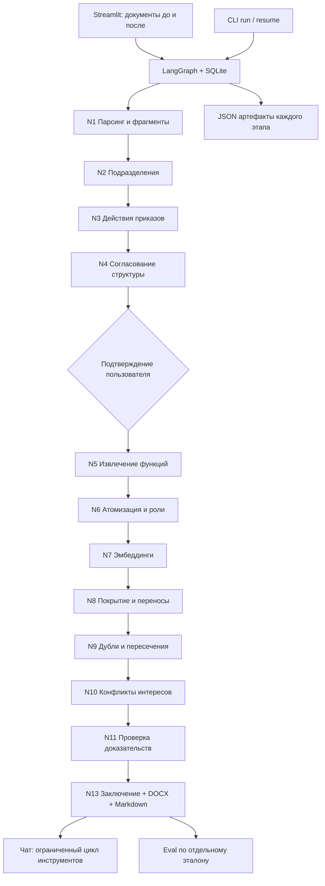

# OrgDiff Agent

Рабочий MVP для сравнения организационной структуры и функций до и после
реорганизации. Агент читает DOCX, PDF и XLSX, сопоставляет подразделения и
функции, показывает потери, дубли и конфликты интересов. Каждый вывод содержит
документ, пункт и точную цитату. Изменения структуры подтверждает пользователь;
результат доступен в интерфейсе, чате и отчёте DOCX/Markdown.

Обязательные этапы T0–T16: [пошаговый план](PLAN.md).
Опциональные нормативка, бенчмаркинг, отдельный модуль рекомендаций и HTTP API
в MVP не включены.

## Быстрый старт: Docker

Нужны Docker Desktop/Engine с Linux-контейнерами и Compose v2.
Python на компьютере не требуется. Из корня проекта в PowerShell:

```powershell
if (-not (Test-Path -LiteralPath .env)) { Copy-Item .env.example .env }
```

В `.env` укажите `OPENAI_API_KEY` и доступные вашему аккаунту модели
`OPENAI_MODEL_EXTRACT`, `OPENAI_MODEL_JUDGE`, `OPENAI_MODEL_REPORT`,
`OPENAI_EMBED_MODEL`. Существующий файл с ключом не перезаписывайте.
Затем:

```powershell
docker compose up --build -d
docker compose ps
```

Откройте **http://localhost:8501**. Первый build загружает зависимости и может
занять несколько минут. Сервис доступен только на этом компьютере.
Документы обрабатываются настроенным LLM-провайдером; холодный анализ требует
API-ключа и расходует токены. Повторные запросы используют кэш.


## Демо за несколько шагов

1. Нажмите «Демо-комплект», затем «Запустить анализ».
2. Во вкладке «Подразделения» проверьте статусы и связи. При необходимости
   измените статус или состав подразделений в раскрывающихся редакторах.
3. Нажмите «Подтвердить и продолжить». Анализ сохранит результат каждого этапа.
4. Откройте «Функции» и «Отклонения»: доступны фильтры, точные цитаты и полный
   текст документа с выделенным пунктом.
5. В «Заключении» скачайте DOCX или Markdown. В «Чате» задайте самостоятельный
   вопрос о конкретном выводе — ответ сопровождается раскрывающимися источниками.
6. В «Метриках» нажмите «Рассчитать eval на демо».

Для своих данных загрузите два комплекта вместо демо. Максимум 50 МБ на файл,
200 МБ суммарно на одну загрузку. Сохранённый анализ открывается из бокового
меню; перезапуск контейнера не удаляет документы, результаты и SQLite checkpoints.
При ошибке доступен повтор незавершённого анализа.

## Измеренное качество

Реальный прогон `mvp-docker`, 23.09.2026; 20 документов, 9 подразделений до и
8 после, 86 исходных функциональных пунктов, 107 атомарных функций.
Снимок результата: [eval/mvp_metrics.json](eval/mvp_metrics.json).

| Категория | TP | FP | FN | Precision | Recall | F1 |
|---|---:|---:|---:|---:|---:|---:|
| Потери | 2 | 0 | 0 | 100% | 100% | 100% |
| Дубли | 2 | 0 | 0 | 100% | 100% | 100% |
| Конфликты интересов | 1 | 1 | 0 | 50% | 100% | 66,7% |
| **Всего, micro** | **5** | **1** | **0** | **83,3%** | **100%** | **90,9%** |

Дополнительно: статусы подразделений **9/9**, эталонные переносы **4/4**,
корректные источники **31/31**, срабатываний на ловушке **0/1**,
найден **1 бонусный конфликт**. Критерии demo из AGENTS.md выполнены.

- **TP** — правильная находка; **FP** — лишнее срабатывание; **FN** — пропуск.
- **Precision = TP / (TP + FP)**: сколько найденных рисков действительно есть
  в эталоне. Здесь 5 правильных из 6 учитываемых находок.
- **Recall = TP / (TP + FN)**: сколько эталонных рисков найдено. Здесь 5 из 5.
- **F1 = 2PR / (P + R)**: баланс точности и полноты. Micro складывает TP/FP/FN
  трёх категорий, а не усредняет их проценты.
- **Unit accuracy** проверяет статус и состав связи подразделений.
  **Source accuracy** проверяет существование источников, реквизиты и цитаты;
  она не доказывает смысловую правильность каждого вывода.

Пограничные случаи не штрафуются, необязательный конфликт считается бонусом.
Частичные потери и пересечения ответственности показаны отдельно: эталон для них
не исчерпывающий. Число карточек в UI поэтому больше числа учитываемых рисков.
Оставшийся FP — дополнительная пара функций квалификации поставщиков и контроля.

Это небольшой синтетический комплект с пятью обязательными рисками. Промпт
уточнялся на нём же; результат не является независимой оценкой качества на любых
документах. До уточнения micro F1 был 83,3%, после — 90,9%. Методика и ограничения:
[eval/README.md](eval/README.md). Confidence модели не заменяет эти метрики.

## Архитектура



N1–N2 извлекают текст и структуру; N3 интерпретирует только пункты приказов.
N4 объединяет приказ и дифф структуры, затем ждёт подтверждения. N5–N7 создают
атомарные функции и поисковые векторы. N8 проверяет каждую функцию «до» против
всех подразделений «после». N9–N10 анализируют дубли и несовместимые роли с учётом
истории. N11 валидирует доказательства. N13 строит заключение по проверенным
findings. Опциональный N12 пропущен. В MVP аналитические узлы последовательны:
оценка новизны дублей и конфликтов зависит от mappings N8; независимые LLM-запросы
внутри этапов выполняются параллельно.

Предметные модули работают без UI и LangGraph. Manifest отслеживает изменения
входов, кода, моделей, промптов и настроек; устаревшие стадии пересчитываются.
SQLite обеспечивает продолжение, блокировка одного run исключает одновременную
запись. Подробности и форматы артефактов: [docs/architecture.md](docs/architecture.md).

## Прослеживаемость

Все вызовы моделей проходят через один `LLMClient`: structured output, ретраи,
валидация ID, кэш и учёт usage. Цитаты копируются из `Fragment.text`, а не пишутся
моделью. Findings без доказательств отбрасываются; неизвестные ссылки заключения
вызывают повтор, затем безопасный шаблон. Чат получает только результаты шести
инструментов чтения, проверяет ссылки и явно сообщает о недостатке данных.
Эти меры ограничивают неподтверждённые ответы, но не гарантируют безошибочную
смысловую классификацию: выводы требуют проверки сотрудником.

## CLI и проверки

```powershell
docker compose exec orgagent orgagent run --before data/demo/before --after data/demo/after --auto-approve --run-id my-demo
docker compose exec orgagent orgagent eval --run-id my-demo --gt data/demo/ground_truth.json
docker compose exec orgagent orgagent report --run-id my-demo --format docx

docker compose --profile tools build tests
docker compose --profile tools run --rm tests
```

Без `--auto-approve` CLI останавливается на согласовании:
`orgagent resume --run-id my-demo --approve` или `--changes edited_changes.json`.
Повтор конкретного этапа: та же команда `run` с `--from-stage coverage`.
Автоматическое согласование не помечается как ручное подтверждение.

377 автономных тестов и Ruff проходят локально и в Docker. Восемь API-тестов
в обычном запуске пропускаются; реальные проверки выполнялись отдельно, включая
полный CLI, браузерный HITL, чат и eval. Дополнительный прогон изменённой копии
проверяет новые имена, коды, порядок колонок и автонумерацию приказа.

Для разработки: `uv sync --locked --extra pipeline --extra ui --extra dev`,
затем `uv run python -m streamlit run ui/app.py` и `uv run pytest -q`.
Полные инструкции по контейнерам, выгрузке файлов и live-тестам:
[docs/docker.md](docs/docker.md).

## Стек и каталог проекта

Python 3.11, Pydantic v2, OpenAI Responses API, LangGraph/SQLite, python-docx,
PyMuPDF, openpyxl, Tesseract (rus/kaz/eng), rapidfuzz, NumPy, diskcache,
Streamlit/Plotly, Jinja2, Typer, pytest, Docker Compose.

| Каталог | Назначение |
|---|---|
| `orgagent/ingest`, `units`, `functions` | Чтение и нормализация документов |
| `orgagent/analysis`, `verify`, `report` | Анализ, проверка, экспорт |
| `orgagent/graph`, `chat`, `llm` | Оркестрация, инструменты чата, единый API-клиент |
| `ui` | Streamlit |
| `config` | Пороги и правила SoD |
| `tests`, `eval` | Тесты и отдельная оценка качества |
| `data/demo` | Демонстрационный комплект и эталон |
| `runs` | Артефакты, загрузки и checkpoints, вне Git |

## Конфигурация и ограничения

Модели, endpoint и ключ — только `.env` (пример в `.env.example`). Пороги top-k,
сходства, параллелизм и параметры LLM — `config/settings.yaml`.
Несовместимые роли — `config/sod_rules.yaml`. Стоимость показывается только при
заданных тарифах; при их отсутствии интерфейс честно пишет «неизвестна».

MVP рассчитан на локальную работу одного аналитика и небольшие комплекты.
Авторизация и многопользовательская изоляция не реализованы. OCR зависит от
качества скана; сложные схемы, повреждённые документы и неполные положения
требуют ручной проверки. Кэш может ускорить повтор, но ответы модели на новых
данных не обязаны быть идентичны. Дальнейшие этапы: независимый контрольный
набор, нормативные требования, бенчмаркинг, локальный совместимый LLM endpoint
для конфиденциальных данных и масштабирование на сотни положений.
