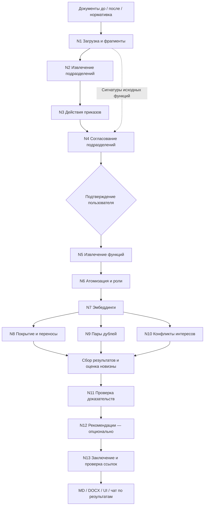

# OrgDiff Agent

Агент сравнивает организационную структуру и функции подразделений до и после
реорганизации. Планируемый результат — изменения подразделений, перемещения и
потери функций, дублирования и конфликты интересов с точными цитатами источников.
Основа проекта — детерминированный пайплайн с проверяемыми вызовами LLM,
подтверждением пользователем и экспортом заключения.

**Готовы T0 и T1 — каркас, модели и хранилище артефактов.** Реализованы предметные
Pydantic-модели, типизированное сохранение/загрузка JSON и каркас CLI.
Пошаговый план со статусами **[Done]** — в [PLAN.md](PLAN.md).
Анализ документов, LLM, интерфейс и экспорт реализуются последовательно по
[AGENTS.md](AGENTS.md#12-порядок-задач-для-codex). Команды `run`, `report`, `eval`
пока выводят номер необходимого этапа и завершаются с ненулевым кодом.

## Основной запуск — Docker

Нужен Docker Desktop/Engine с Linux-контейнерами и Docker Compose v2.
Из корня проекта в PowerShell:

```powershell
if (-not (Test-Path -LiteralPath .env)) { Copy-Item .env.example .env }
docker compose up --build --abort-on-container-exit --exit-code-from orgagent
docker compose --profile tools build tests
docker compose run --rm tests
```

**Сейчас контейнер проверяет настройки и завершает работу.** Постоянный
веб-сервис появится после реализации пайплайна и UI. Полный сервис будет
запускаться через `docker compose up --build` на T15. Тесты выполняются в
отдельном контейнере без сети и без API-ключа.

Подробности команд, mounts и постоянных volumes — в
[docs/docker.md](docs/docker.md). Python на компьютере для Docker-запуска не нужен.

## Локальная среда разработки

Нужен Python 3.11+. Из корня репозитория в PowerShell:

```powershell
python -m venv .venv
.\.venv\Scripts\python.exe -m pip install -e ".[dev]"
if (-not (Test-Path .env)) { Copy-Item .env.example .env }
.\.venv\Scripts\orgagent.exe --help
.\.venv\Scripts\orgagent.exe check
.\.venv\Scripts\python.exe -m pytest -q
.\.venv\Scripts\ruff.exe check .
```

Если окружение уже создано, повторно создавать его не требуется. `.env` создавайте
только при его отсутствии, чтобы сохранить свои настройки. Ключ API для T0–T1 не нужен.

Для установленного `uv` предусмотрена зафиксированная среда:

```powershell
uv sync --extra dev --locked
uv run orgagent --help
uv run orgagent check
uv run pytest -q
uv run ruff check .
```

В Linux/macOS путь к командам — `.venv/bin/`; пример окружения можно скопировать
командой `cp .env.example .env`. Поддерживается установка `pip install -e ".[dev]"`.
Полный стек будет устанавливаться через `.[dev,pipeline,ui]` по мере реализации.
Docker-проверки уже доступны; браузерный сценарий относится к T13.

## Архитектура



Это целевая схема; узлы N1–N13 ещё не реализованы. Ответственность модулей,
артефакты, зависимости и правила возобновления описаны в
[docs/architecture.md](docs/architecture.md). Разбор пробелов исходного плана
внесён в [дополнение AGENTS.md](AGENTS.md#15-уточнения-плана-по-аудиту-t0).

## Прослеживаемость

Каждый вывод будет связан с существующими `fragment_id`. Цитата копируется из
`Fragment.text`; модель не сочиняет её. Перед публикацией выводов проверяются
ссылки, поля источников и цитаты. Заключение строится по подтверждённым данным
и ссылается на ID выводов. Проверка ссылок не заменяет экспертную оценку смысла:
предусмотрены HITL, доверие к выводу и явное сообщение о недостатке документов.

## Стек и зависимости

Python 3.11+, Pydantic v2 и Typer образуют основу. Группа `pipeline` содержит
OpenAI SDK, LangGraph с SQLite, python-docx, PyMuPDF, openpyxl, pytesseract,
rapidfuzz, numpy, diskcache и Jinja2. Группа `ui` — Streamlit и Plotly; `api`
оставлена опциональной. Тестирование — pytest и ruff в группе `dev`.

Дополнения к таблице стека AGENTS.md: `python-dotenv` читает предусмотренный
`.env`, `PyYAML` безопасно загружает предусмотренные YAML-файлы,
`langgraph-checkpoint-sqlite` поставляет отдельно распространяемый SQLite
чекпоинтер, `uvicorn` нужен только для опционального FastAPI. Ruff прямо указан
в T0. Новые предметные библиотеки не добавлены. Tesseract с языковыми пакетами
`rus`, `kaz`, `eng` — внешняя зависимость будущего OCR, не Python-пакет.

## Датасет и сценарий демо

Исходный комплект находится в `HackAlem_test_dataset/`, тестовая копия —
в `data/demo/`. По запросу пользователя читаемые кириллические имена восстановлены
в обоих каталогах; содержимое файлов не изменено. Журнал старых/новых имён и
SHA-256 — [eval/dataset_renames.json](eval/dataset_renames.json).
Отчёт о проверке содержимого:
[eval/dataset_audit.md](eval/dataset_audit.md).

Для повторной подготовки из исходного комплекта:

```powershell
uv run python eval/prepare_demo.py --source HackAlem_test_dataset --destination data/demo --ground-truth ground_truth.json
```

Целевой сценарий после T13: загрузка двух комплектов → согласование подразделений
→ таблица функций → проверка отклонений → скачивание DOCX. Файл
`ground_truth.json` используется только тестами и оценкой, не аналитическим кодом.

## Оценка качества

Прогона анализа ещё не было; численные результаты не заявляются.

| Метрика | Цель на demo | Результат |
|---|---:|---|
| Потери функций | 2 из 2 | Будет измерено на T12 |
| Дублирования | 2 из 2 | Будет измерено на T12 |
| Основной конфликт интересов | 1 из 1 | Будет измерено на T12 |
| Ложный дубль в контрольной паре | 0 | Будет измерено на T12 |
| Ложные срабатывания | ≤ 1 | Будет измерено на T12 |

Обычный `pytest -q` работает без сети и ключа. Интеграционные LLM-тесты будут
помечены `llm`; их запуск требует явного `pytest --run-llm -m llm`.

## Структура

```text
config/           пороги, пути, флаги и правила SoD
orgagent/
  models.py       конфигурационные и предметные модели, RunManifest
  config.py       загрузка и валидация .env + YAML
  cli.py          CLI и локальная проверка настроек
  ingest/        парсеры и фрагменты — T2
  llm/           единый клиент и промпты — T3
  units/         подразделения и приказы — T4
  functions/     функции и роли — T5
  analysis/      покрытие, дубли, конфликты — T6–T8
  verify/        проверка доказательств — T9
  report/        заключение и экспорт — T10
  graph/         состояние и LangGraph — T11
  chat/          чат по готовому прогону — T14
  storage.py     типизированные атомарные save/load JSON
ui/              Streamlit — T13
api/             опциональный HTTP API
eval/            подготовка/аудит fixtures и оценка — T12
data/demo/       копия тестового комплекта
runs/            результаты прогонов, исключены из Git
tests/           автономные проверки
docs/            архитектура и статус реализации
```

Файлы будущих модулей T2–T17 пока содержат только назначение и номер этапа.
Контракт хранилища T1 и примеры использования — в
[docs/storage.md](docs/storage.md).

## Конфигурация

`.env` задаёт ключ, модели, URL совместимого API и каталог кэша. Ключи не
попадают в Git и сериализованные настройки. Значения LLM читаются именно из
выбранного файла `.env`, без неявного поиска в родительских каталогах и без
подстановки переменных окружения. Отсутствие `.env` допустимо для локальных
проверок T0–T1; Docker требует существующий файл для read-only mount.

`config/settings.yaml` задаёт пороги поиска, OCR, флаги этапов и пути. Относительные
пути вычисляются от каталога проекта; неизвестные параметры и недопустимые
значения отклоняются. `.env.example` содержит примеры моделей из исходного плана;
их доступность будет проверяться на T3. `temperature: null` позволяет клиенту
не передавать параметр моделям, которые его не поддерживают.
`config/sod_rules.yaml` хранит правила разделения обязанностей для T8.

## Этапы и ограничения

Порядок T0–T17 сохранён; Docker-инфраструктура для проверок подготовлена раньше
финальной интеграции. [PLAN.md](PLAN.md) фиксирует шаги, критерии и статусы,
[docs/implementation_status.md](docs/implementation_status.md) — результаты проверок.
Сейчас нет готового анализа, UI, скриншотов или сгенерированных заключений.
Следующие этапы — парсеры (T2) и единый LLM-клиент (T3).

После основной реализации планируются проверка нормативных требований,
бенчмаркинг, совместимые локальные модели и проверка на незнакомом комплекте.
Для масштабирования понадобится измерить стоимость, время и полноту извлечения,
а не только сходство эмбеддингов.
